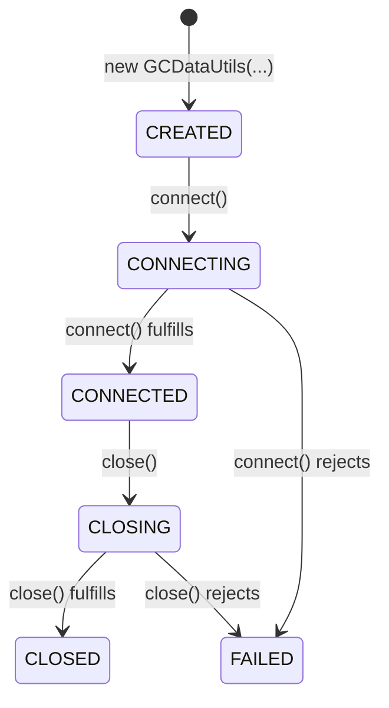

# Genesys Cloud Data Utilities for Node.js

[](https://opensource.org/licenses/MIT)

The Genesys Cloud Data Utilities for Node.js is an easy-to-use toolbox to extract data from Genesys Cloud organizations.

### Features

- **Easy to use**: Simply pass the Genesys Cloud OAuth client ID, client secret, and region to the constructor of the `GCDataUtils` class, and you are ready to go. No need to worry about HTTP status codes, pagination, next URIs, or any other low-level details, the module takes care of all that for you, its methods return the data directly.
- **Based on the High-performance Genesys Cloud Platform API client for Node.js**: This module is built on top of the [Genesys Cloud Platform API client for Node.js](https://github.com/jfabello/gc-platform-api-client), therefore it inherits all the features of that module, including high performance, automatic token refresh, rate limit handling, and retry with exponential backoff logic.

## Table of Contents

- [What is New](#what-is-new)
  - [Version 0.1.0](#version-010)
- [Installation](#installation)
- [Usage](#usage)
  - [Basic Usage](#basic-usage)
  - [Advanced Usage](#advanced-usage)
- [Genesys Cloud Data Utilities States](#genesys-cloud-data-utilities-states)
- [The `GCDataUtils` Class](#the-gcdatautils-class)
  - [Static Properties](#static-properties)
  - [Instance Properties](#instance-properties)
  - [Instance Methods](#instance-methods)
    - [Constructor](#constructor)
    - [`connect()`](#connect)
    - [`close()`](#close)
    - [`getAllUsers()`](#getallusers)
    - [`getAllQueues()`](#getallqueues)
    - [`getQueueMembers()`](#getqueuemembers)
    - [`getConversationsDatalakeAvailabilityTimestamp()`](#getconversationsdatalakeavailabilitytimestamp)
    - [`getUsersDatalakeAvailabilityTimestamp()`](#getusersdatalakeavailabilitytimestamp)
    - [`getOldestQueueCreationTimestamp()`](#getoldestqueuecreationtimestamp)
    - [`getConversationsDetailsFromDatalake()`](#getconversationsdetailsfromdatalake)
    - [`getUsersDetailsFromDatalake()`](#getusersdetailsfromdatalake)
    - [`getEventsFromAuditLog()`](#geteventsfromauditlog)
    - [`on()`](#on)
- [Testing](#testing)
- [Contributing](#contributing)
- [License](#license)

## What is New

### Version 0.1.0

- Initial beta release.

## Installation

You can install this module via `npm`:

```shell
npm install @jfabello/gc-data-utils
```

## Usage

To use the `gc-data-utils` module, first import it into your code and then create an instance of the `GCDataUtils` class.

### Basic Usage

This is a basic example of how to use the Genesys Cloud Data Utilities. It demonstrates how to connect to Genesys Cloud, fetch all the users in an organization, and then disconnect.

```javascript
import { GCDataUtils } from "@jfabello/gc-data-utils";

// This is just for demonstration purposes, never hardcode your credentials
const gcClientId = "f6eb9da0-4590-4bb7-82a0-f85afbfa1070";
const gcClientSecret ="pHe8l6Ro4raxeph13etrujufri9ecl5lwr0hlCrO-jQ";
const gcRegion = "us-east-1";

// Create a new GCDataUtils instance
const gcDataUtils = new GCDataUtils(gcClientId, gcClientSecret, gcRegion);

// Connect to Genesys Cloud
await gcDataUtils.connect();

// Fetch all the users in the organization
for await (const users of gcDataUtils.getAllUsers()) {
	// Log the users information
	for (const user of users) {
		console.dir(user, { depth: null });
	}
}

// Disconnect from Genesys Cloud
await gcDataUtils.close();
```

### Advanced Usage

This is a complex example that demonstrates how to use the Genesys Cloud Platform API client to fetch all the audit log events since the oldest queue was created.

Note that this example does not use `try`/`catch` blocks to handle errors. Please make sure to handle errors properly in your production code.

```javascript
import { GCDataUtils } from "@jfabello/gc-data-utils";

// This is just for demonstration purposes, never hardcode your credentials
const gcClientId = "f6eb9da0-4590-4bb7-82a0-f85afbfa1070";
const gcClientSecret ="pHe8l6Ro4raxeph13etrujufri9ecl5lwr0hlCrO-jQ";
const gcRegion = "us-east-1";

// Create a new GCDataUtils instance
const gcDataUtils = new GCDataUtils(gcClientId, gcClientSecret, gcRegion);

// Connect to Genesys Cloud
await gcDataUtils.connect();

// Set up the interval
const startTimestamp = await gcDataUtils.getOldestQueueCreationTimestamp();
const endTimestamp = new Date();

let auditLogEventscounter = 0;

for await (const auditLogEvents of gcDataUtils.getEventsFromAuditLog(startTimestamp, endTimestamp, "ContactCenter", { entityType: "Queue" })) {
	auditLogEventscounter += auditLogEvents.length;
	console.dir(auditLogEvents, { depth: 2 });
}

console.log(`Total audit log events returned: ${auditLogEventscounter}`);

// Disconnect from Genesys Cloud
await gcDataUtils.close();
```

## Genesys Cloud Data Utilities States

The `GCDataUtils` class provides the following states:



## The `GCDataUtils` Class

### Static Properties

- `CREATED`: A symbol that represents the CREATED state of the client.
- `CONNECTING`: A symbol that represents the CONNECTING state of the client.
- `CONNECTED`: A symbol that represents the CONNECTED state of the client.
- `CLOSING`: A symbol that represents the CLOSING state of the client.
- `CLOSED`: A symbol that represents the CLOSED state of the client.
- `FAILED`: A symbol that represents the FAILED state of the client.
- `errors`: An object that contains the Genesys Cloud data utilities error classes as properties.

### Instance Properties

- `state`: A read-only property that returns the current state of the client.

### Instance Methods

#### `constructor()`

Creates a new instance of the Genesys Cloud data utilities client.

##### Parameters

- `gcClientId` (string): The Genesys Cloud OAuth client ID. Must be a valid UUID.
- `gcClientSecret` (string): The Genesys Cloud OAuth client secret.
- `gcRegion` (string): The Genesys Cloud region. For example: us-east-1, ca-central-1, ap-south-1, etc.
- `options` (object): Optional configuration options.
  - `socketTimeout` (number): HTTP socket timeout in milliseconds (default: 60000).
  - `timeBetweenRequests` (number): Time in milliseconds between API calls (default: 200).
  - `maxRetries` (number): Maximum number of retries for retryable errors (default: 5).

##### Throws

- `ERROR_GC_DATA_UTILS_CLIENT_ID_TYPE_INVALID`: If the Genesys Cloud OAuth client ID is not a string.
- `ERROR_GC_DATA_UTILS_CLIENT_ID_INVALID_UUID`: If the Genesys Cloud OAuth client ID is not a valid UUID.
- `ERROR_GC_DATA_UTILS_CLIENT_SECRET_TYPE_INVALID`: If the Genesys Cloud OAuth client secret is not a string.
- `ERROR_GC_DATA_UTILS_REGION_TYPE_INVALID`: If the Genesys Cloud region is not a string.
- `ERROR_GC_DATA_UTILS_REGION_INVALID`: If the Genesys Cloud region is not a valid region.
- `ERROR_GC_DATA_UTILS_SOCKET_TIMEOUT_TYPE_INVALID`: If the socket timeout option is not an integer.
- `ERROR_GC_DATA_UTILS_SOCKET_TIMEOUT_OUT_OF_BOUNDS`: If the socket timeout option is less than 1 millisecond.
- `ERROR_GC_DATA_UTILS_TIME_BETWEEN_REQUESTS_TYPE_INVALID`: If the time between requests option is not an integer.
- `ERROR_GC_DATA_UTILS_TIME_BETWEEN_REQUESTS_OUT_OF_BOUNDS`: If the time between requests option is less than 1 millisecond.
- `ERROR_GC_DATA_UTILS_MAX_RETRIES_TYPE_INVALID`: If the max retries option is not an integer.
- `ERROR_GC_DATA_UTILS_MAX_RETRIES_OUT_OF_BOUNDS`: If the max retries option is less than 1.
- `ERROR_GC_DATA_UTILS_INTERNAL_ERROR`: If an internal error occurred.

#### `connect()`

Connects the Genesys Cloud data utilities client.

##### Returns

A promise that fulfills to `true` if the client connects successfully.

##### Throws

- `ERROR_GC_DATA_UTILS_CONNECT_UNAVAILABLE`: If the client is not in a state that allows it to connect to Genesys Cloud.
- `ERROR_GC_DATA_UTILS_CLIENT_ID_NOT_FOUND`: If the Genesys Cloud OAuth client ID is not found.
- `ERROR_GC_DATA_UTILS_AUTHENTICATION_FAILURE`: If the Genesys Cloud OAuth authentication fails.
- `ERROR_GC_DATA_UTILS_UNEXPECTED_RESPONSE_ERROR`: If the Genesys Cloud OAuth access token request returns an unexpected response.
- `ERROR_GC_DATA_UTILS_UNEXPECTED_STATUS_CODE`: If the Genesys Cloud OAuth access token request returns an unexpected HTTP status code.
- `ERROR_GC_DATA_UTILS_INTERNAL_ERROR`: If an internal error occurs while connecting the client.

#### `close()`

Closes the Genesys Cloud data utilities client connection.

##### Parameters

This method does not accept any parameters.

##### Returns

A promise that fulfills to `true` if the client is gracefully disconnected.

##### Throws

- `ERROR_GC_DATA_UTILS_CLOSE_UNAVAILABLE`: If the client is not in a state that allows it to close.
- `ERROR_GC_DATA_UTILS_UNEXPECTED_RESPONSE_ERROR`: If the Genesys Cloud OAuth access token deletion request returns an unexpected response.
- `ERROR_GC_DATA_UTILS_UNEXPECTED_STATUS_CODE`: If the Genesys Cloud OAuth access token deletion request returns an unexpected HTTP status code.
- `ERROR_GC_DATA_UTILS_INTERNAL_ERROR`: If an internal error occurs while closing the client connection.

#### `getAllUsers()`

Fetches all users, including inactive and deleted users.

##### Parameters

- `options` (object): The options object.
  - `pageSize` (number): The number of users to return per page (default: 100).

##### Returns

An async generator that yields the users.

##### Throws

- `ERROR_GC_DATA_UTILS_CLIENT_NOT_CONNECTED`: If the client is not connected.
- `ERROR_GC_DATA_UTILS_PAGE_SIZE_TYPE_INVALID`: If the page size option is not a number.
- `ERROR_GC_DATA_UTILS_PAGE_SIZE_OUT_OF_BOUNDS`: If the page size option is not a positive integer.
- `ERROR_GC_DATA_UTILS_INCOMPLETE_RESPONSE`: If the response is missing a required property or there is a property type mismatch.

#### `getAllQueues()`

Fetches all queues.

##### Parameters

- `options` (object): The options object.
  - `pageSize` (number): The number of queues to return per page (default: 100).

##### Returns

An async generator that yields the queues.

##### Throws

- `ERROR_GC_DATA_UTILS_CLIENT_NOT_CONNECTED`: If the client is not connected.
- `ERROR_GC_DATA_UTILS_PAGE_SIZE_TYPE_INVALID`: If the page size option is not a number.
- `ERROR_GC_DATA_UTILS_PAGE_SIZE_OUT_OF_BOUNDS`: If the page size option is not a positive integer.
- `ERROR_GC_DATA_UTILS_INCOMPLETE_RESPONSE`: If the response is missing a required property or there is a property type mismatch.

#### `getQueueMembers()`

Fetches all members of a queue.

##### Parameters

- `queueId` (string): The ID of the queue.
- `options` (object): The options object.
  - `pageSize` (number): The number of members to return per page (default: 100).

##### Returns

An async generator that yields the members of the queue.

##### Throws

- `ERROR_GC_DATA_UTILS_CLIENT_NOT_CONNECTED`: If the client is not connected.
- `ERROR_GC_DATA_UTILS_QUEUE_ID_TYPE_INVALID`: If the queue ID is not a string.
- `ERROR_GC_DATA_UTILS_QUEUE_ID_INVALID_UUID`: If the queue ID is not a valid UUID.
- `ERROR_GC_DATA_UTILS_PAGE_SIZE_TYPE_INVALID`: If the page size option is not a number.
- `ERROR_GC_DATA_UTILS_PAGE_SIZE_OUT_OF_BOUNDS`: If the page size option is not a positive integer.
- `ERROR_GC_DATA_UTILS_INCOMPLETE_RESPONSE`: If the response is missing a required property or there is a property type mismatch.

#### `getConversationsDatalakeAvailabilityTimestamp()`

Fetches the conversations datalake availability timestamp.

##### Returns

A promise that fulfills to a `Date` object representing the conversations datalake availability timestamp.

##### Throws

- `ERROR_GC_DATA_UTILS_CLIENT_NOT_CONNECTED`: If the client is not connected.
- `ERROR_GC_DATA_UTILS_INCOMPLETE_RESPONSE`: If the response is missing a required property or there is a property type mismatch.

#### `getUsersDatalakeAvailabilityTimestamp()`

Fetches the users datalake availability timestamp.

##### Returns

A promise that fulfills to a `Date` object representing the users datalake availability timestamp.

##### Throws

- `ERROR_GC_DATA_UTILS_CLIENT_NOT_CONNECTED`: If the client is not connected.
- `ERROR_GC_DATA_UTILS_INCOMPLETE_RESPONSE`: If the response is missing a required property or there is a property type mismatch.

#### `getOldestQueueCreationTimestamp()`

Fetches the oldest queue creation timestamp.

##### Parameters

- `options` (object): The options object.
  - `pageSize` (number): The number of queues to fetch per page (default: 100).

##### Returns

A promise that fulfills to a `Date` object representing the oldest queue creation timestamp.

##### Throws

- `ERROR_GC_DATA_UTILS_CLIENT_NOT_CONNECTED`: If the client is not connected.
- `ERROR_GC_DATA_UTILS_PAGE_SIZE_TYPE_INVALID`: If the page size option is not a number.
- `ERROR_GC_DATA_UTILS_PAGE_SIZE_OUT_OF_BOUNDS`: If the page size option is not a positive integer.
- `ERROR_GC_DATA_UTILS_INCOMPLETE_RESPONSE`: If the response is missing a required property or there is a property type mismatch.

#### `getConversationsDetailsFromDatalake()`

Fetches conversations details from the datalake.

##### Parameters

- `startTimestamp` (Date): The start of the interval to fetch.
- `endTimestamp` (Date): The end of the interval to fetch.
- `options` (object): The options object.
  - `pageSize` (number): The number of conversations details to fetch per page (default: 2000).
  - `daysPerJob` (number): The number of days to fetch per job (default: 30).

##### Returns

An async generator that yields the conversations.

##### Throws

- `ERROR_GC_DATA_UTILS_CLIENT_NOT_CONNECTED`: If the client is not connected.
- `ERROR_GC_DATA_UTILS_START_TIMESTAMP_TYPE_INVALID`: If the start timestamp is not a `Date` object.
- `ERROR_GC_DATA_UTILS_END_TIMESTAMP_TYPE_INVALID`: If the end timestamp is not a `Date` object.
- `ERROR_GC_DATA_UTILS_INTERVAL_MISMATCH`: If the start timestamp is not earlier than the end timestamp.
- `ERROR_GC_DATA_UTILS_PAGE_SIZE_TYPE_INVALID`: If the page size option is not an integer.
- `ERROR_GC_DATA_UTILS_PAGE_SIZE_OUT_OF_BOUNDS`: If the page size option is not a positive integer.
- `ERROR_GC_DATA_UTILS_DAYS_PER_JOB_TYPE_INVALID`: If the days per job option is not an integer.
- `ERROR_GC_DATA_UTILS_DAYS_PER_JOB_OUT_OF_BOUNDS`: If the days per job option is not a positive integer.
- `ERROR_GC_DATA_UTILS_START_TIMESTAMP_NO_DATA`: If the start timestamp is later than the conversations details datalake availability timestamp.
- `ERROR_GC_DATA_UTILS_INCOMPLETE_RESPONSE`: If the response is missing a required property or there is a property type mismatch.

#### `getUsersDetailsFromDatalake()`

Fetches users details from the datalake.

##### Parameters

- `startTimestamp` (Date): The start of the interval to fetch.
- `endTimestamp` (Date): The end of the interval to fetch.
- `options` (object): The options object.
  - `pageSize` (number): The number of users details to fetch per page (default: 2000).
  - `daysPerJob` (number): The number of days to fetch per job (default: 30).

##### Returns

An async generator that yields the users.

##### Throws

- `ERROR_GC_DATA_UTILS_CLIENT_NOT_CONNECTED`: If the client is not connected.
- `ERROR_GC_DATA_UTILS_START_TIMESTAMP_TYPE_INVALID`: If the start timestamp is not a `Date` object.
- `ERROR_GC_DATA_UTILS_END_TIMESTAMP_TYPE_INVALID`: If the end timestamp is not a `Date` object.
- `ERROR_GC_DATA_UTILS_INTERVAL_MISMATCH`: If the start timestamp is not earlier than the end timestamp.
- `ERROR_GC_DATA_UTILS_PAGE_SIZE_TYPE_INVALID`: If the page size option is not an integer.
- `ERROR_GC_DATA_UTILS_PAGE_SIZE_OUT_OF_BOUNDS`: If the page size option is not a positive integer.
- `ERROR_GC_DATA_UTILS_DAYS_PER_JOB_TYPE_INVALID`: If the days per job option is not an integer.
- `ERROR_GC_DATA_UTILS_DAYS_PER_JOB_OUT_OF_BOUNDS`: If the days per job option is not a positive integer.
- `ERROR_GC_DATA_UTILS_START_TIMESTAMP_NO_DATA`: If the start timestamp is later than the users details datalake availability timestamp.
- `ERROR_GC_DATA_UTILS_INCOMPLETE_RESPONSE`: If the response is missing a required property or there is a property type mismatch.

#### `getEventsFromAuditLog()`

Fetches events from the audit log.

##### Parameters

- `startTimestamp` (Date): The start of the interval to fetch.
- `endTimestamp` (Date): The end of the interval to fetch.
- `serviceName` (string): The name of the service to fetch events from.
- `options` (object): The options object.
  - `entityType` (string): The type of entity to fetch events for. If not provided, all entity types for the service will be fetched.
  - `pageSize` (number): The number of audit log events to fetch per page (default: 500).

##### Returns

An async generator that yields the queue events.

##### Throws

- `ERROR_GC_DATA_UTILS_CLIENT_NOT_CONNECTED`: If the client is not connected.
- `ERROR_GC_DATA_UTILS_START_TIMESTAMP_TYPE_INVALID`: If the start timestamp is not a `Date` object.
- `ERROR_GC_DATA_UTILS_END_TIMESTAMP_TYPE_INVALID`: If the end timestamp is not a `Date` object.
- `ERROR_GC_DATA_UTILS_INTERVAL_MISMATCH`: If the start timestamp is not earlier than the end timestamp.
- `ERROR_GC_DATA_UTILS_SERVICE_NAME_TYPE_INVALID`: If the service name is not a string.
- `ERROR_GC_DATA_UTILS_ENTITY_TYPE_TYPE_INVALID`: If the entity type is not a string.
- `ERROR_GC_DATA_UTILS_PAGE_SIZE_TYPE_INVALID`: If the page size option is not a number.
- `ERROR_GC_DATA_UTILS_PAGE_SIZE_OUT_OF_BOUNDS`: If the page size option is not a positive integer.
- `ERROR_GC_DATA_UTILS_INCOMPLETE_RESPONSE`: If the response is missing a required property or there is a property type mismatch.

#### `on()`

Adds an event listener for the specified event.

##### Parameters

- `eventName` (string): The name of the event to listen for.
- `callback` (function): The function to call when the event is emitted.

##### Events

- `state-change`: Emitted when the state of the client changes.

## Testing

To run the tests for this module, first clone the repository using the following command:

```shell
git clone https://github.com/jfabello/gc-data-utils.git
```

Then, navigate to the project directory and install the npm dependencies, this will install the Jest testing framework:

```shell
cd gc-data-utils
npm install
```

Set the environment variables with the Genesys Cloud credentials and region:

```shell
export GC_CLIENT_ID="f6eb9da0-4590-4bb7-82a0-f85afbfa1070"
export GC_CLIENT_SECRET="pHe8l6Ro4raxeph13etrujufri9ecl5lwr0hlCrO-jQ"
export GC_REGION="us-east-1"
```

Finally, run the tests using the following command:

```shell
npm test
```

## Contributing

Unfortunately, we are not able to accept contributions at this time.

If you find a bug in the code, please open an issue.

Thank you for your understanding.

## License

This project is licensed under the MIT License. See the [LICENSE](LICENSE) file for details.
